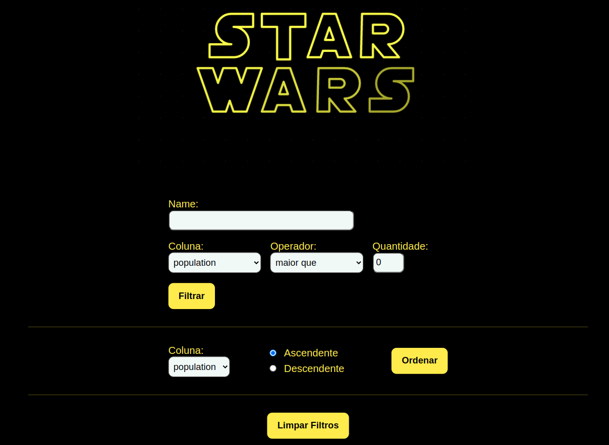
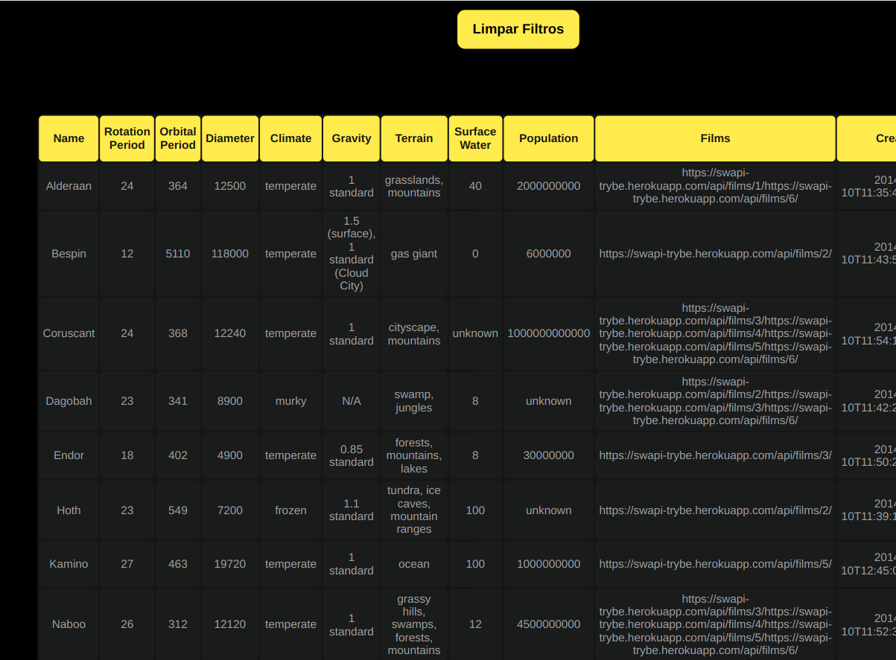

# Projeto Star Wars

Este foi o primeiro projeto o qual utilizamos componentes funcionais no React.

Com os componentes funcionais, colocamos em prática também alguns dos principais hooks nativos do React, que fazem o papel do estado do componente _(useState)_, que substituem o Redux _(useContext)_ e os que cumprem o papel do ciclo de vida do componente _(useEffect)_.

Para isso, fizemos uma aplicação que consome uma API que retorna informações dos planetas do universo Star Wars e criamos uma tabela com alguns filtros para auxiliar na busca do planeta e suas respectivas informações.

---

# Habilidades

- Utilizar a _Context API_ do **React** para gerenciar estado.
- Utilizar o _React Hook useState_;
- Utilizar o _React Hook useContext_;
- Utilizar o _React Hook useEffect_;
- Criar _React Hooks_ customizados.

---

## Requisitos

Ao todo, incluindo os bônus, foram 7 requisitos:

#### 1. Faça uma requisição para o endpoint /planets da API de Star Wars e preencha uma tabela com os dados retornados, com exceção dos da coluna residents;

#### 2. Filtre a tabela através de um texto, inserido num *campo de texto*, exibindo somente os planetas cujos nomes incluam o texto digitado;

#### 3. Crie um filtro para valores numéricos;

#### 4. Implemente múltiplos filtros numéricos;

#### 5. Não utilize filtros repetidos;

#### 6. Apague o filtro de valores numéricos e desfaça as filtragens dos dados da tabela ao clicar no ícone de X de um dos filtros.

### Bônus

#### 7. Ordene as colunas de forma ascendente ou descendente.